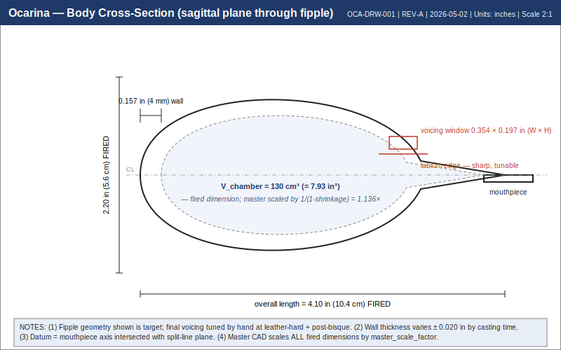
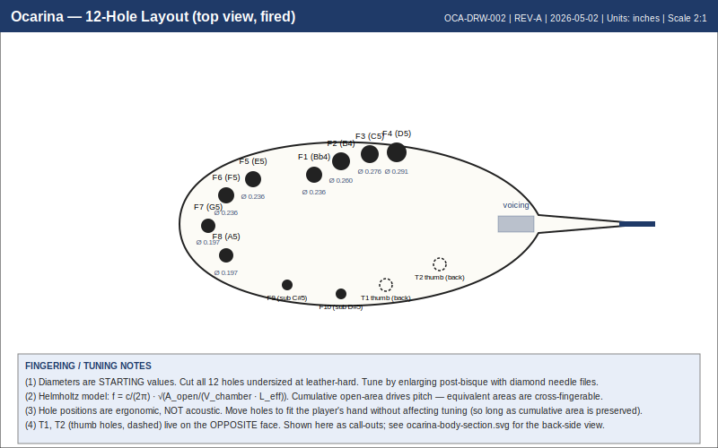
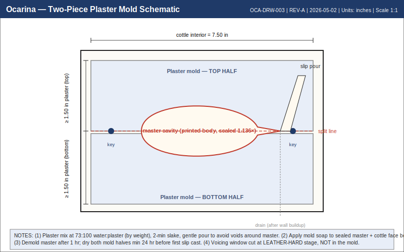
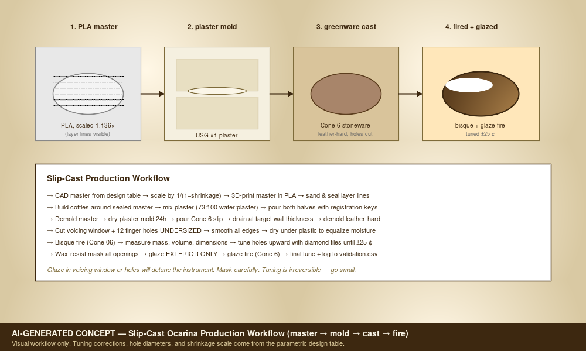
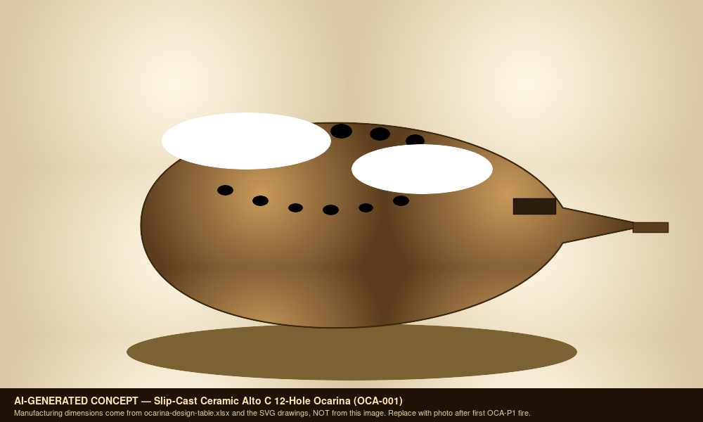
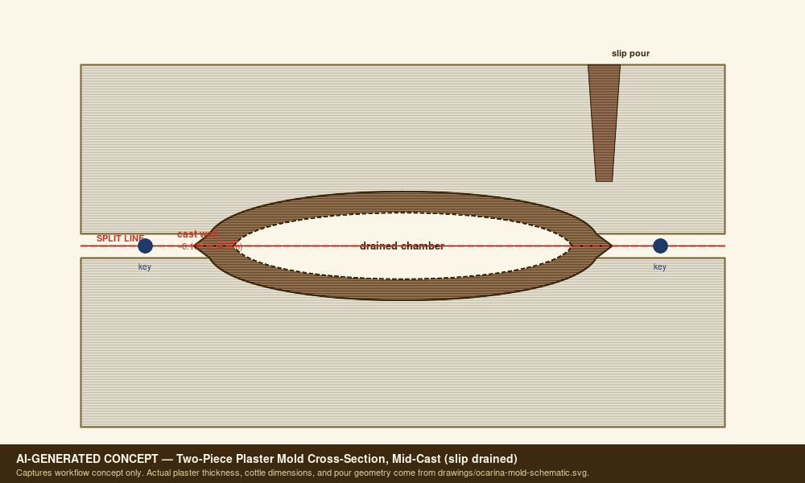

# Slip-Cast Ceramic Ocarina (OCA-001) — v3 Smoke Test Print Packet

Generated: 2026-05-02
Packet folder: `/sessions/charming-bold-fermat/mnt/GitHub/ocarina`

## File Map

| File | Purpose |
| --- | --- |
| `design.md` | Project intent, catalog metadata, assumptions, and validation plan. |
| `bom.csv` | Starter bill of materials with part categories, quantities, drawing refs, and notes. |
| `sourcing.csv` | Supplier/search tracker with specs, price/date fields, lead time, substitutes, and risks. |
| `cut-list.csv` | Rough/final stock sizes, material, grain/orientation, operations, yield, and offcuts. |
| `drawing-brief.md` | Manufacturing drawing and technical product sketch brief. |
| `assembly-manual.md` | Shop-facing sequence, tools, fixtures, safety, tuning, finishing, and maintenance notes. |
| `validation.csv` | Target/measured values, tolerance, environment, result, and tuning/build action log. |
| `supplier-rfq.md` | Supplier email/request-for-quote starter. |
| `visual-bom-brief.md` | Art direction for an image-forward visual BOM. |
| `wolfram-starter.wl` | Wolfram starter for physics, optimization, visualization, and validation. |
| `README.md` | Project artifact. |
| `capstone-deck.md` | Project artifact. |
| `print-packet.md` | Project artifact. |

<div class="page-break"></div>

## design.md

Project intent, catalog metadata, assumptions, and validation plan.

# Ocarina Build Packet

## Source

- Design table: `docs/Ocarina.xlsx`
- Sheet: `Ocarina`
- Inspected range: `A1:H141`
- Workbook content observed: design inputs, size library, Helmholtz calculator, 12-hole fingering chart, ceramic workflow, BOM, design notes, and Wolfram notebook notes.

## Design Intent

Build a slip-cast ceramic Alto C 12-hole ocarina using a 3D-printed master and plaster mold workflow. The current table is focused on the standard "sweet potato" vessel-flute form, but the same model can be used as the baseline for sculptural vessel flutes.

## Governing Model

Ocarinas behave primarily as Helmholtz resonators:

```text
f = c/(2*pi) * sqrt(A_open/(V_chamber * L_eff))
```

Unlike a transverse flute or Native American style flute, pitch is driven by chamber volume and total open-hole area, not tone-hole distance along a bore. Hole position is still important for ergonomics, grip, and fingering logic.

## Current Workbook Inputs

| Field | Current value |
| --- | --- |
| Ocarina type | Alto C, 12-hole |
| Chamber volume | 130 cm3 |
| Wall thickness | 0.4 cm |
| Voicing window width | 0.9 cm |
| Voicing window height | 0.5 cm |
| Speed of sound | 34300 cm/s |
| Clay body | Cone 6 stoneware |
| Shrinkage | 12 percent |
| Target low note | A4, 440 Hz |
| Target high note | F6, 1397 Hz |

## Critical Design Features

- Chamber volume is the master tuning input. Measure it by water fill after CAD, master print, greenware, bisque, and glaze fire.
- Voicing window area sets the all-closed low-note behavior along with volume and effective neck length.
- Fipple geometry is the playability bottleneck: windway gap, labium angle, channel smoothness, and edge sharpness should be treated as first-class dimensions.
- Finger holes should start undersized. Enlarge to sharpen; flattening after over-enlarging is possible but slower and less clean.
- Exterior-only glazing is preferred for tuning stability and acoustic response. Mask the fipple, holes, and chamber interior.

## Workbook Improvement Notes

During inspection, rows 39-42 of the 12-hole fingering chart contain formulas for hole area, cumulative open area, and calculated frequency. Rows 43-51 currently show placeholder `=` cells instead of filled formulas. Recommended next workbook cleanup:

1. Copy the area formula pattern from `D40:D42` through `D51`.
2. Copy the cumulative area pattern from `E40:E42` through `E51`.
3. Copy the frequency formula pattern from `F40:F42` through `F51`.
4. Add measured frequency, cents error, and tuning action columns.
5. Add a note that hole combinations can be cross-fingered if total open area is equivalent.
6. Verify the size-library `Length (in)` column. Inspection showed serial-like values such as `46180`, so those cells may have been formatted or entered incorrectly.

## Mold Strategy

Use a 2-piece plaster mold for the main body. The first prototype can use a press-molded body to speed iteration, but production should move toward slip casting once the fipple and chamber volume are stable.

Recommended mold/CAD features:

- Split line around the widest body perimeter.
- Positive registration keys that do not trap clay.
- Pour/drain path or assembly opening appropriate to the chosen casting workflow.
- Removable or cleanable fipple detail. If the fipple is too delicate for the mold, cast a blank and hand-cut the voicing at leather-hard stage.
- Master scale factor: `1/(1 - shrinkage)`; for 12 percent shrinkage this is about `1.136`.

## Prototype Ladder

| Prototype | Goal | Success criteria |
| --- | --- | --- |
| OCA-P0 voicing tile | Practice windway/labium only | Clear tone on a disposable test cavity |
| OCA-P1 closed vessel | Verify chamber volume and fipple | Stable A4-ish all-closed tone before finger holes |
| OCA-P2 4-hole | Prove tuning workflow | Four tuned notes within +/-25 cents after bisque |
| OCA-P3 12-hole | Full range test | Chromatic pattern playable, no blocked grip |
| OCA-P4 matched set | Soprano C, Alto C, Bass C | Shared mold logic and glaze family |

## Open Assumptions

- Pricing in the workbook is an estimate and has not been date-checked.
- Clay shrinkage must be measured for Tony's actual slip, not assumed from supplier average.
- The fipple may need empirical iteration beyond the Helmholtz model.
- Exact ergonomics depend on hand span and final sculptural body shape.

<div class="page-break"></div>

## bom.csv

Starter bill of materials with part categories, quantities, drawing refs, and notes.

| item_id | category | item | qty | spec | make_buy | estimated_cost | source_note | drawing_ref | notes |
| --- | --- | --- | --- | --- | --- | --- | --- | --- | --- |
| OCA-BOM-001 | Master | 3D printed body master | 1 set | PLA or resin printed top and bottom master | Make | $2-5 | Workbook estimate not date-checked | OCA-DRW-001 | Scale master for measured clay shrinkage. |
| OCA-BOM-002 | Mold | #1 pottery plaster | 10 lb | USG #1 pottery plaster or equivalent | Buy | $15-25 | Workbook estimate not date-checked | OCA-DRW-002 | Enough for several small mold sets depending on cottle size. |
| OCA-BOM-003 | Clay | Cone 6 stoneware slip or clay body | 25 lb | Slip casting body or press-moldable clay | Buy | $20-35 | Workbook estimate not date-checked | OCA-DRW-003 | Record batch and measured shrinkage. |
| OCA-BOM-004 | Finish | Cone 6 exterior glaze | 3-5 pints | Food-safe or durable ceramic glaze | Buy | $30-60 | Workbook estimate not date-checked | OCA-DRW-004 | Mask fipple, holes, and interior. |
| OCA-BOM-005 | Tuning | Diamond needle files | 1 set | Assorted profiles | Buy | $10-20 | Workbook estimate not date-checked | OCA-DRW-005 | Needed after bisque and final fire. |
| OCA-BOM-006 | Tuning | Chromatic tuner or analysis app | 1 | Cent-accurate tuner | Buy | $15-30 | Workbook estimate not date-checked | OCA-VAL-001 | Use same app/settings across prototypes. |
| OCA-BOM-007 | Mold | Mold soap or release | 1 bottle | Murphy's oil soap or mold release | Buy | $5-10 | Workbook estimate not date-checked | OCA-DRW-002 | For sealed master and plaster parting surfaces. |
| OCA-BOM-008 | Firing | Bisque and glaze firing | per load | Cone 06 bisque and Cone 6 glaze | Buy | $20-50/load | Workbook estimate not date-checked | OCA-VAL-002 | Record firing schedule and kiln location. |
| OCA-BOM-009 | Masking | Wax resist | 1 small jar | Brushable wax resist | Buy | TBD | Add supplier/date before purchase | OCA-DRW-004 | Protect tuning-critical holes and fipple. |
| OCA-BOM-010 | Measurement | Graduated syringe or burette | 1 | Water-fill volume measurement | Buy | TBD | Add supplier/date before purchase | OCA-VAL-003 | Needed for chamber volume validation. |

<div class="page-break"></div>

## sourcing.csv

Supplier/search tracker with specs, price/date fields, lead time, substitutes, and risks.

| item_id | item | required_spec | search_terms | supplier_candidates | date_checked | unit_price | lead_time | substitution_rule | risk_note |
| --- | --- | --- | --- | --- | --- | --- | --- | --- | --- |
| OCA-SRC-001 | #1 pottery plaster | Pottery mold plaster suitable for absorbent ceramic molds | USG #1 pottery plaster 10 lb 25 lb | TBD |  |  |  | Use equivalent pottery plaster if absorption and strength are similar | Wrong plaster can give weak molds or poor casting absorption. |
| OCA-SRC-002 | Cone 6 casting slip | Stoneware slip with known shrinkage and firing schedule | cone 6 stoneware casting slip shrinkage | TBD |  |  |  | Substitute only after measuring shrinkage bars | Unknown shrinkage invalidates CAD scale factor. |
| OCA-SRC-003 | PLA or resin | Print material that can be sanded and sealed | PLA filament smooth master mold making resin print | TBD |  |  |  | Any stable printable material is acceptable if sealed | Layer lines transfer into mold and cast. |
| OCA-SRC-004 | Mold release | Mold soap compatible with plaster | pottery mold soap plaster release | TBD |  |  |  | Commercial mold soap preferred | Release failure can damage master or mold. |
| OCA-SRC-005 | Diamond files | Small round and tapered profiles | diamond needle file set ceramic tuning | TBD |  |  |  | Diamond burrs can substitute for some work | Coarse tools chip fired ceramic. |
| OCA-SRC-006 | Wax resist | Brushable wax for glaze masking | ceramic wax resist glaze masking | TBD |  |  |  | Latex or tape only if kiln-safe workflow is confirmed | Glaze in holes or windway can ruin tuning. |
| OCA-SRC-007 | Measurement tools | Cent-accurate tuner plus volume measurement | chromatic tuner cents water volume graduated syringe | TBD |  |  |  | Phone app acceptable for early tests | Inconsistent measurement hides process drift. |

<div class="page-break"></div>

## cut-list.csv

Rough/final stock sizes, material, grain/orientation, operations, yield, and offcuts.

| cut_id | part | qty | rough_dimensions_in | final_dimensions_in | material | orientation | operation | tolerance_in | yield_or_offcut | notes |
| --- | --- | --- | --- | --- | --- | --- | --- | --- | --- | --- |
| OCA-CUT-001 | Master body upper half (3D-printed) | 1 | 4.50 x 3.50 x 2.50 envelope | master scale = 1/(1-shrinkage); for 12% shrinkage = 1.136x fired body | PLA or sealable resin | X along mouthpiece axis; Z up; mark split-line and chamber datum | Print, sand layer lines, fill voids, seal/sand, sign with build ID | +/-0.010 | Save offcut sprues for shrinkage coupons | Master scale factor must be re-derived from MEASURED clay shrinkage before final master. |
| OCA-CUT-002 | Master body lower half (3D-printed) | 1 | 4.50 x 3.50 x 2.50 envelope | mirror of OCA-CUT-001 | PLA or sealable resin | X along mouthpiece axis; Z up; mark split-line | Print, sand, fill, seal | +/-0.010 | Reuse offcut sprues for shrinkage coupons | Same scale factor as OCA-CUT-001. |
| OCA-CUT-003 | Wooden cottle boards (mold making) | 4 | 8 x 6 x 0.75 each | 7.50 x 5.50 x 0.75 each | Melamine-faced MDF or sealed plywood | Smooth face inward; mark inner clamping zone | Cut, edge-seal, drill clamping holes | +/-0.030 | One sheet of 24 x 18 x 0.75 yields all 4 | Clean parting wax/release before each pour. |
| OCA-CUT-004 | Plaster mother mold half (poured) | 2 | 7.50 x 5.50 x 2.00 each | 7.50 x 5.50 x 1.50-1.75 each (around master) | USG #1 pottery plaster (or equiv.) | Pour with master keyed to first half; second half over registration | Mix to 73:100 water:plaster (by weight); 2-min slake; pour around sealed master | +/-0.060 | Trim spew/edge after demold; recover small offcuts as test slabs | Min 1.50 in plaster around master where practical for stiffness. |
| OCA-CUT-005 | Greenware vessel (slip-cast) | 1 per pour | ~3.95 x 3.07 x 2.20 (master cavity wet) | ~3.50 x 2.72 x 1.95 fired (12% shrink) | Cone 6 stoneware casting slip | Mouthpiece axis along master split | Slip pour > drain at target wall (~0.16 in / 0.4 cm) > demold leather-hard | N/A (process-controlled) | Reuse demold trim/fettling waste as slip recycle | Wall thickness drives drying time and tap tone — measure on noncritical trim. |
| OCA-CUT-006 | Voicing window cut (leather-hard) | 1 | N/A | 0.354 x 0.197 (window W x H = 0.9 x 0.5 cm per design) | Cone 6 greenware | Cut perpendicular to mouthpiece axis | Score, lift, clean labium edge with rib | +/-0.010 | N/A | Cut undersized; tune by enlarging at bisque tuning step. |
| OCA-CUT-007 | Finger holes (12-hole layout — leather-hard) | 12 | N/A | 0.16-0.31 dia each (start undersized; see design table OCA-DRW-005) | Cone 6 greenware | Per fingering chart row D40:F51 of design table | Brass tube cutter or hole punch; clean burr with damp finger | +/-0.010 (start) | N/A | All 12 holes start at design-table 'minimum' diameter; enlarge at tuning. |
| OCA-CUT-008 | Post-bisque tuning trim | as needed | N/A | Within +/-25 cents of target frequency per validation.csv | Bisqued ceramic | N/A | Diamond needle file or fine diamond burr in steps | +/-0.005 dimensional; +/-25 cents acoustic | Diamond burr offcuts are kiln dust — bag and discard | Document each enlarge step on validation row. |
| OCA-CUT-009 | Wax resist mask (pre-glaze) | 1 application | N/A | ~0.020 in dry film over voicing window + all 12 holes + interior | Brushable wax resist | N/A | Brush-apply; dry per supplier; check all openings clear | Visual | N/A | Mask all acoustic edges to keep glaze out of windway and holes. |
| OCA-CUT-010 | Glaze application (exterior only) | 1 application | N/A | ~0.005-0.010 in per coat; 1-2 coats exterior | Cone 6 satin or matte glaze | Avoid waxed regions | Dip / brush / spray exterior only | +/-0.005 (visual) | N/A | Glaze in voicing window or holes will detune the instrument. |

<div class="page-break"></div>

## drawing-brief.md

Manufacturing drawing and technical product sketch brief.

# Ocarina Drawing Brief

## Required Views

- Top view with body outline, hole layout, hand assignment, and centerline.
- Side view with mouthpiece axis, windway height, labium angle, body thickness, and split line.
- Section through fipple showing windway, labium, window, and chamber connection.
- Section through body showing chamber volume reference, target wall thickness, and mold split.
- Detail view for hole diameters and post-fire tuning allowance.
- Mold view showing plaster parting line, registration keys, pour/drain plan, and cottle clearance.

## Critical Dimensions

| Dimension | Source | Tolerance intent |
| --- | --- | --- |
| Chamber volume | Workbook input and water-fill measurement | Tuning critical |
| Voicing window width/height | Workbook input | Playability critical |
| Windway gap | CAD/test-piece measurement | Playability critical |
| Labium angle and edge thickness | CAD/test-piece measurement | Playability critical |
| Wall thickness | Workbook input and cast measurement | Tone/drying critical |
| Hole diameters | Workbook chart and tuning log | Tuning critical |
| Master scale factor | Measured clay shrinkage | Process critical |

## Notes For CAD

- Store chamber volume as a named parameter.
- Store shrinkage factor as a named parameter.
- Separate final fired dimensions from master dimensions.
- Mark fipple geometry as prototype-sensitive; do not freeze it until test pieces speak reliably.
- Include a versioned body ID so castings can be tied back to the CAD master.

<div class="page-break"></div>

## assembly-manual.md

Shop-facing sequence, tools, fixtures, safety, tuning, finishing, and maintenance notes.

# Ocarina Assembly Manual

## Scope

This manual covers a slip-cast or press-molded ceramic ocarina based on `docs/Ocarina.xlsx`. It is written for prototype builds where the first goal is repeatable tone and validated tuning, not decorative finish.

## Tools

- CAD package for master design.
- 3D printer and sanding/sealing supplies.
- Cottle boards, plaster mixing bucket, scale, mold soap, and clamps.
- Stoneware slip or workable clay body.
- Small hole cutters, drill bits, needle tools, loop tools, ribs, sponge, and fettling knife.
- Chromatic tuner, microphone, calipers, graduated syringe or water-fill vessel.
- Diamond needle files or fine diamond burrs.
- Wax resist, glaze, and kiln access.

## Process

1. **Set design inputs**
   - Confirm target ocarina size, chamber volume, voicing window, wall thickness, clay body, and shrinkage.
   - Create a build ID before CAD begins.

2. **Model the master**
   - Model the body as a controlled-volume vessel.
   - Include split-line planning, registration features, and a fipple strategy.
   - Scale the master by `1/(1 - measured_shrinkage)`.

3. **Print and finish the master**
   - Print the master with enough wall strength to survive mold making.
   - Sand layer lines and seal the surface.
   - Mark datums: centerline, mouthpiece axis, split plane, and hole reference side.

4. **Make the mold**
   - Apply release to the sealed master and cottle surfaces.
   - Pour plaster with at least 1.5 inches around the master where practical.
   - Add registration keys and dry the mold fully before casting.

5. **Cast or press the body**
   - For slip casting, pour slip, wait for target wall buildup, drain, and demold at leather-hard stage.
   - For press molding, press even clay slabs into both mold halves and join with scored slip.
   - Measure sample wall thickness at a noncritical trimmed area.

6. **Cut fipple and holes**
   - Establish the windway first.
   - Cut the labium cleanly and test blow before the body fully dries.
   - Cut finger holes undersized.

7. **Dry slowly**
   - Dry under plastic until moisture equalizes.
   - Watch the mouthpiece and seam areas for cracks.

8. **Bisque fire**
   - Bisque to the clay body's recommended schedule.
   - Measure mass, volume, hole diameters, and frequencies.

9. **Tune after bisque**
   - Enlarge holes to raise pitch.
   - Refine the fipple only in small steps.
   - Record measured frequency and cents error after each change.

10. **Glaze**
    - Wax resist the windway, labium, holes, and any interior opening.
    - Keep glaze away from the acoustic edges.

11. **Final fire and validation**
    - Fire to the chosen glaze schedule.
    - Re-measure all tuning points.
    - Save final dimensions and tuning data back into the validation log.

## Failure Modes To Watch

- Weak or no tone: windway too tall, labium too blunt, air jet missing edge.
- Pitch too flat: chamber too large, open area too small, or neck length too long.
- Pitch too sharp: chamber too small, open area too large, or over-filed holes.
- Warped mouthpiece: uneven drying or thin unsupported fipple geometry.
- Glaze-choked note: glaze reduced hole or windway opening.

<div class="page-break"></div>

## validation.csv

Target/measured values, tolerance, environment, result, and tuning/build action log.

| build_id | stage | date | clay_body | shrinkage_expected_pct | master_scale_factor | chamber_volume_cm3 | wall_thickness_cm | voicing_w_cm | voicing_h_cm | hole_id | target_note | target_freq_hz | measured_freq_hz | cents_error | action | result | notes |
| --- | --- | --- | --- | --- | --- | --- | --- | --- | --- | --- | --- | --- | --- | --- | --- | --- | --- |
| OCA-P0 | voicing_tile |  |  |  |  |  |  |  |  | all_closed | A4 | 440 |  |  |  |  | Practice fipple before full body. |
| OCA-P1 | greenware |  |  |  |  | 130 | 0.4 | 0.9 | 0.5 | all_closed | A4 | 440 |  |  |  |  | Measure before drying if possible. |
| OCA-P1 | bisque |  |  |  |  | TBD | TBD | TBD | TBD | all_closed | A4 | 440 |  |  |  |  | First real model check. |
| OCA-P1 | glaze_fire |  |  |  |  | TBD | TBD | TBD | TBD | all_closed | A4 | 440 |  |  |  |  | Record glaze shift. |
| OCA-P2 | bisque |  |  |  |  | TBD | TBD | TBD | TBD | hole_1 | Bb4 | 466.2 |  |  |  |  | Start undersized and enlarge gradually. |
| OCA-P2 | bisque |  |  |  |  | TBD | TBD | TBD | TBD | hole_2 | B4 | 493.9 |  |  |  |  | Record hole diameter after tuning. |
| OCA-P2 | bisque |  |  |  |  | TBD | TBD | TBD | TBD | hole_3 | C5 | 523.3 |  |  |  |  | Check breath pressure sensitivity. |
| OCA-P3 | glaze_fire |  |  |  |  | TBD | TBD | TBD | TBD | hole_12 | A5 | 880 |  |  |  |  | Full 12-hole validation row. |

<div class="page-break"></div>

## supplier-rfq.md

Supplier email/request-for-quote starter.

# Supplier RFQ — Slip-Cast Ceramic Ocarina (OCA-001 family)

> Use this as a template for outreach to ceramic-supply, plaster, mold-making, and finishing suppliers. Customize the Subject and address fields per recipient.

**Subject:** RFQ — slip-cast ceramic ocarina prototype materials and consumables

Hello,

I'm a mechanical R&D engineer prototyping a small family of slip-cast ceramic ocarinas (vessel flutes, ~3-4 in long, ~0.16 in / 4 mm wall) and need quotes for the following. The first build is an Alto C 12-hole prototype based on the parametric Helmholtz design table at [tonykoop/ocarina](https://github.com/tonykoop/ocarina).

## Items

| # | Item | Required spec | Approx. qty (per prototype run) |
|---|---|---|---|
| 1 | Cone 6 stoneware casting slip | Mature Cone 6 stoneware slip with **published shrinkage** (X/Y/Z), **water absorption %**, and **firing schedule**. White or light buff body preferred for tone consistency over dark iron-bearing slips. | 1-5 gal |
| 2 | #1 pottery plaster | USG #1 Pottery Plaster (or equivalent) suitable for absorbent slip-cast molds. Need **water:plaster ratio**, **set time**, **soluble salt content**. | 10 lb (single mold) — 50 lb (production mold set) |
| 3 | Mold release / mold soap | Plaster-compatible parting agent (Murphy's-type oil soap or commercial mold soap). | 1 bottle / 16 oz |
| 4 | Cone 6 exterior glaze | Food-safe (or durable non-food-safe) satin or matte glaze. Color: TBD per family — likely earth/buff/cream. Glaze must not bridge holes or windway. | 3-5 pints |
| 5 | Brushable wax resist | Standard ceramic wax resist for masking voicing window, finger holes, and chamber interior pre-glaze. | 1 small jar / 8 oz |
| 6 | Diamond needle file set (post-bisque tuning) | Assorted profiles (round, half-round, taper) ~3-6 mm; resin-bonded acceptable. | 1 set |
| 7 | Hole cutters / brass tube cutters | Round cutters from ~0.156 in (4 mm) to ~0.313 in (8 mm) diameter for greenware finger-hole cutting. | 1 set |
| 8 | Bisque + glaze firing service (if local) | Cone 06 bisque + Cone 6 glaze fire; small cubic-foot kiln load. | 2 fires per prototype |
| 9 | (Optional) Master printing/outsource | If you do high-resolution PLA or resin prints up to ~5 in long with **0.005 in dimensional accuracy**, please quote. We currently print in-house but want a backup. | 1-5 master pairs |

## What we need in your quote

- **Unit price** and any volume breaks
- **Minimum order quantity**
- **Current stock status** and **lead time**
- **Shipping estimate** to 94566 (Pleasanton, CA) — or local pickup option
- **Material safety data sheet (MSDS)** and **technical data sheet** for items 1, 2, 4, 5
- **Recommended substitutions** for thin-walled (~4 mm) musical instrument bodies
- For item 1: most recent **shrinkage test data** for your batch (we will re-measure on our side, but a baseline matters)

## Acceptance criteria

The prototypes are measured for X/Y/Z shrinkage, bore/cavity volume after firing, wall-thickness consistency, and acoustic tuning (chromatic tuner, ±25 cents target post-bisque). Slip with unknown or wildly variable shrinkage invalidates the master scale factor (currently `1/(1-0.12) = 1.136`), so reproducibility data is more valuable than headline price.

The repo is a private R&D portfolio repo; we do not need any IP-restricted documents. Public-domain MSDS and supplier spec sheets are sufficient.

Thank you,

Tony Koop
Mechanical R&D Engineer
tonykoop@gmail.com
github.com/tonykoop/ocarina (private; access on request)

<div class="page-break"></div>

## visual-bom-brief.md

Art direction for an image-forward visual BOM.

# Ocarina Visual BOM Brief

## Goal

Create a one-page visual BOM that helps a builder understand the ceramic ocarina workflow from digital master to tuned fired instrument.

## Layout

- Header: "Slip-Cast Ceramic Ocarina - Alto C Prototype".
- Hero image: finished ocarina or clean CAD render.
- Process strip: CAD master, 3D print, plaster mold, greenware, bisque, tuning, glaze fire.
- BOM table: item number, part/material, quantity, spec, estimated cost, make/buy, image.
- Callout inset: fipple section with windway, labium, and voicing window labels.
- Validation inset: chamber volume, all-closed note, highest tested note, cents error.

## Image Requirements

Use real shop photos when available. Generated or rendered placeholders should be labeled as placeholders until replaced with:

- Master print photo.
- Plaster mold photo.
- Greenware body photo.
- Fipple close-up.
- Final fired instrument.
- Tuning tool/photo of measurement setup.

<div class="page-break"></div>

## wolfram-starter.wl

Wolfram starter for physics, optimization, visualization, and validation.

```wolfram
(* Ocarina Helmholtz notebook starter *)

ClearAll["Global`*"];

c = 34300; (* cm/s at about 20 C *)
targetA4 = 440;
volumeCm3 = 130;
wallCm = 0.4;
windowWcm = 0.9;
windowHcm = 0.5;

voicingAreaCm2[w_, h_] := w*h;
endCorrectionCm[area_] := 0.6*Sqrt[area/Pi];
helmholtzHz[area_, volume_, neckLength_] :=
  (c/(2*Pi))*Sqrt[area/(volume*neckLength)];
centsError[measured_, target_] := 1200*Log[2, measured/target];

baseArea = voicingAreaCm2[windowWcm, windowHcm];
baseNeck = wallCm + endCorrectionCm[baseArea];
baseFreq = helmholtzHz[baseArea, volumeCm3, baseNeck];

holeDiameterMmToAreaCm2[d_] := Pi*(d/20)^2;
targetFreq[midi_] := 440*2^((midi - 69)/12);
areaForFrequency[f_, volume_, neckLength_] :=
  volume*neckLength*(2*Pi*f/c)^2;

(* Candidate cumulative area table for A4 to A5. *)
notes = {
  {"A4", 69}, {"Bb4", 70}, {"B4", 71}, {"C5", 72},
  {"C#5", 73}, {"D5", 74}, {"D#5", 75}, {"E5", 76},
  {"F5", 77}, {"F#5", 78}, {"G5", 79}, {"G#5", 80}, {"A5", 81}
};

areaTable = Table[
  With[{freq = targetFreq[midi]},
    {name, freq, areaForFrequency[freq, volumeCm3, baseNeck]}
  ],
  { {name, midi}, notes}
];

areaTable // TableForm
```

<div class="page-break"></div>

## README.md

Project artifact.

# Ocarina — Slip-Cast Ceramic Vessel-Flute Family

> *Engineering documentation for a 3D-printed-master, plaster-mold, cone-6-stoneware slip-cast ocarina family — from Helmholtz physics through the parametric design table to a manufacturable build packet.*

 — v3 Smoke Test
- Musical instrument documentation capstone
- Build packet: ocarina
- Generated: 2026-05-02

---

# Project Intent
- Build a slip-cast ceramic Alto C 12-hole ocarina using a 3D-printed master and plaster mold workflow. The current table is focused on the standard "sweet potato" vessel-flute form, but the same model can be used as the baseline for sculptural vessel flutes.

_Speaker notes:_ Read design.md before committing to dimensions or sourcing decisions.

---

# Physics Model
- Ocarinas behave primarily as Helmholtz resonators:

```
f = c/(2*pi) * sqrt(A_open/(V_chamber * L_eff))
```

_Speaker notes:_ Governing equation extracted verbatim from design.md. Apply empirical corrections (NAF K2, scale offsets) only where the model permits — see references/acoustic-models.md.

---

# How To Use This Packet
- Start with design.md for intent and assumptions.
- Use bom.csv, sourcing.csv, and cut-list.csv before buying or cutting.
- Use drawing-brief.md and CAD/CNC folders before machining.
- Print the packet for shopping, shop work, and validation.

---

# File Map
- design.md: Project intent, catalog metadata, assumptions, and validation plan.
- bom.csv: Starter bill of materials with part categories, quantities, drawing refs, and notes.
- sourcing.csv: Supplier/search tracker with specs, price/date fields, lead time, substitutes, and risks.
- cut-list.csv: Rough/final stock sizes, material, grain/orientation, operations, yield, and offcuts.
- drawing-brief.md: Manufacturing drawing and technical product sketch brief.
- assembly-manual.md: Shop-facing sequence, tools, fixtures, safety, tuning, finishing, and maintenance notes.
- validation.csv: Target/measured values, tolerance, environment, result, and tuning/build action log.
- supplier-rfq.md: Supplier email/request-for-quote starter.

---

# Build Workflow
- Design and assumptions
- Source materials and hardware
- Prepare stock, fixtures, and CNC/laser/lathe setup
- Assemble, tune, finish, and validate

---

# Sourcing And BOM
- BOM gives part categories and drawing references.
- Sourcing tracks search terms, supplier candidates, price/date, lead time, substitutions.
- Visual BOM brief turns the parts list into a presentation-ready image board.

---

# Shop Packet
- Cut list for lumber/sheet/blank planning.
- Assembly manual for away-from-keyboard work.
- Validation sheet for measured dimensions, tuning, pass/fail checks.

---

# Drawings, CAD, CNC
- drawing-brief.md defines required views, dimensions, datums, sketch intent.
- cad/ holds models and design tables.
- cnc/ holds CAM, toolpaths, setup sheets, dry-run notes.
- drawings/ holds PDFs, SVGs, DXFs, drawing exports.





---

# Images And Screenshots
- images/exploded-view-concept.png
- images/hero-concept.png
- images/mold-cross-section-concept.png





---

# Validation Plan
- A4 = 440 Hz reference check.
- Tuning targets logged in validation.csv.
- Critical dimensions verified against design sheet and CAD.
- Photos and revision notes after each major step.

---

# Open Risks / Decisions
- TBDs in design sheet and BOM.
- Supplier price/availability not yet verified.
- Generated images marked as concept placeholders.
- Empirical corrections await measured prototype data.

---

# Next Actions
- Replace TBDs with measured/source-backed values.
- Verify live supplier price and availability before buying.
- Export final drawings and visual BOM images.
- Regenerate this deck and print packet after final edits.

---

<div class="page-break"></div>

## print-packet.md

Project artifact.

# Slip-Cast Ceramic Ocarina (OCA-001) — Build Packet Print Packet

Generated: 2026-05-02
Packet folder: `/sessions/charming-bold-fermat/mnt/GitHub/ocarina`

## File Map

| File | Purpose |
| --- | --- |
| `design.md` | Project intent, catalog metadata, assumptions, and validation plan. |
| `bom.csv` | Starter bill of materials with part categories, quantities, drawing refs, and notes. |
| `sourcing.csv` | Supplier/search tracker with specs, price/date fields, lead time, substitutes, and risks. |
| `cut-list.csv` | Rough/final stock sizes, material, grain/orientation, operations, yield, and offcuts. |
| `drawing-brief.md` | Manufacturing drawing and technical product sketch brief. |
| `assembly-manual.md` | Shop-facing sequence, tools, fixtures, safety, tuning, finishing, and maintenance notes. |
| `validation.csv` | Target/measured values, tolerance, environment, result, and tuning/build action log. |
| `supplier-rfq.md` | Supplier email/request-for-quote starter. |
| `visual-bom-brief.md` | Art direction for an image-forward visual BOM. |
| `wolfram-starter.wl` | Wolfram starter for physics, optimization, visualization, and validation. |
| `README.md` | Project artifact. |
| `capstone-deck.md` | Project artifact. |
| `print-packet.md` | Project artifact. |

<div class="page-break"></div>

## design.md

Project intent, catalog metadata, assumptions, and validation plan.

# Ocarina Build Packet

## Source

- Design table: `docs/Ocarina.xlsx`
- Sheet: `Ocarina`
- Inspected range: `A1:H141`
- Workbook content observed: design inputs, size library, Helmholtz calculator, 12-hole fingering chart, ceramic workflow, BOM, design notes, and Wolfram notebook notes.

## Design Intent

Build a slip-cast ceramic Alto C 12-hole ocarina using a 3D-printed master and plaster mold workflow. The current table is focused on the standard "sweet potato" vessel-flute form, but the same model can be used as the baseline for sculptural vessel flutes.

## Governing Model

Ocarinas behave primarily as Helmholtz resonators:

```text
f = c/(2*pi) * sqrt(A_open/(V_chamber * L_eff))
```

Unlike a transverse flute or Native American style flute, pitch is driven by chamber volume and total open-hole area, not tone-hole distance along a bore. Hole position is still important for ergonomics, grip, and fingering logic.

## Current Workbook Inputs

| Field | Current value |
| --- | --- |
| Ocarina type | Alto C, 12-hole |
| Chamber volume | 130 cm3 |
| Wall thickness | 0.4 cm |
| Voicing window width | 0.9 cm |
| Voicing window height | 0.5 cm |
| Speed of sound | 34300 cm/s |
| Clay body | Cone 6 stoneware |
| Shrinkage | 12 percent |
| Target low note | A4, 440 Hz |
| Target high note | F6, 1397 Hz |

## Critical Design Features

- Chamber volume is the master tuning input. Measure it by water fill after CAD, master print, greenware, bisque, and glaze fire.
- Voicing window area sets the all-closed low-note behavior along with volume and effective neck length.
- Fipple geometry is the playability bottleneck: windway gap, labium angle, channel smoothness, and edge sharpness should be treated as first-class dimensions.
- Finger holes should start undersized. Enlarge to sharpen; flattening after over-enlarging is possible but slower and less clean.
- Exterior-only glazing is preferred for tuning stability and acoustic response. Mask the fipple, holes, and chamber interior.

## Workbook Improvement Notes

During inspection, rows 39-42 of the 12-hole fingering chart contain formulas for hole area, cumulative open area, and calculated frequency. Rows 43-51 currently show placeholder `=` cells instead of filled formulas. Recommended next workbook cleanup:

1. Copy the area formula pattern from `D40:D42` through `D51`.
2. Copy the cumulative area pattern from `E40:E42` through `E51`.
3. Copy the frequency formula pattern from `F40:F42` through `F51`.
4. Add measured frequency, cents error, and tuning action columns.
5. Add a note that hole combinations can be cross-fingered if total open area is equivalent.
6. Verify the size-library `Length (in)` column. Inspection showed serial-like values such as `46180`, so those cells may have been formatted or entered incorrectly.

## Mold Strategy

Use a 2-piece plaster mold for the main body. The first prototype can use a press-molded body to speed iteration, but production should move toward slip casting once the fipple and chamber volume are stable.

Recommended mold/CAD features:

- Split line around the widest body perimeter.
- Positive registration keys that do not trap clay.
- Pour/drain path or assembly opening appropriate to the chosen casting workflow.
- Removable or cleanable fipple detail. If the fipple is too delicate for the mold, cast a blank and hand-cut the voicing at leather-hard stage.
- Master scale factor: `1/(1 - shrinkage)`; for 12 percent shrinkage this is about `1.136`.

## Prototype Ladder

| Prototype | Goal | Success criteria |
| --- | --- | --- |
| OCA-P0 voicing tile | Practice windway/labium only | Clear tone on a disposable test cavity |
| OCA-P1 closed vessel | Verify chamber volume and fipple | Stable A4-ish all-closed tone before finger holes |
| OCA-P2 4-hole | Prove tuning workflow | Four tuned notes within +/-25 cents after bisque |
| OCA-P3 12-hole | Full range test | Chromatic pattern playable, no blocked grip |
| OCA-P4 matched set | Soprano C, Alto C, Bass C | Shared mold logic and glaze family |

## Open Assumptions

- Pricing in the workbook is an estimate and has not been date-checked.
- Clay shrinkage must be measured for Tony's actual slip, not assumed from supplier average.
- The fipple may need empirical iteration beyond the Helmholtz model.
- Exact ergonomics depend on hand span and final sculptural body shape.

<div class="page-break"></div>

## bom.csv

Starter bill of materials with part categories, quantities, drawing refs, and notes.

| item_id | category | item | qty | spec | make_buy | estimated_cost | source_note | drawing_ref | notes |
| --- | --- | --- | --- | --- | --- | --- | --- | --- | --- |
| OCA-BOM-001 | Master | 3D printed body master | 1 set | PLA or resin printed top and bottom master | Make | $2-5 | Workbook estimate not date-checked | OCA-DRW-001 | Scale master for measured clay shrinkage. |
| OCA-BOM-002 | Mold | #1 pottery plaster | 10 lb | USG #1 pottery plaster or equivalent | Buy | $15-25 | Workbook estimate not date-checked | OCA-DRW-002 | Enough for several small mold sets depending on cottle size. |
| OCA-BOM-003 | Clay | Cone 6 stoneware slip or clay body | 25 lb | Slip casting body or press-moldable clay | Buy | $20-35 | Workbook estimate not date-checked | OCA-DRW-003 | Record batch and measured shrinkage. |
| OCA-BOM-004 | Finish | Cone 6 exterior glaze | 3-5 pints | Food-safe or durable ceramic glaze | Buy | $30-60 | Workbook estimate not date-checked | OCA-DRW-004 | Mask fipple, holes, and interior. |
| OCA-BOM-005 | Tuning | Diamond needle files | 1 set | Assorted profiles | Buy | $10-20 | Workbook estimate not date-checked | OCA-DRW-005 | Needed after bisque and final fire. |
| OCA-BOM-006 | Tuning | Chromatic tuner or analysis app | 1 | Cent-accurate tuner | Buy | $15-30 | Workbook estimate not date-checked | OCA-VAL-001 | Use same app/settings across prototypes. |
| OCA-BOM-007 | Mold | Mold soap or release | 1 bottle | Murphy's oil soap or mold release | Buy | $5-10 | Workbook estimate not date-checked | OCA-DRW-002 | For sealed master and plaster parting surfaces. |
| OCA-BOM-008 | Firing | Bisque and glaze firing | per load | Cone 06 bisque and Cone 6 glaze | Buy | $20-50/load | Workbook estimate not date-checked | OCA-VAL-002 | Record firing schedule and kiln location. |
| OCA-BOM-009 | Masking | Wax resist | 1 small jar | Brushable wax resist | Buy | TBD | Add supplier/date before purchase | OCA-DRW-004 | Protect tuning-critical holes and fipple. |
| OCA-BOM-010 | Measurement | Graduated syringe or burette | 1 | Water-fill volume measurement | Buy | TBD | Add supplier/date before purchase | OCA-VAL-003 | Needed for chamber volume validation. |

<div class="page-break"></div>

## sourcing.csv

Supplier/search tracker with specs, price/date fields, lead time, substitutes, and risks.

| item_id | item | required_spec | search_terms | supplier_candidates | date_checked | unit_price | lead_time | substitution_rule | risk_note |
| --- | --- | --- | --- | --- | --- | --- | --- | --- | --- |
| OCA-SRC-001 | #1 pottery plaster | Pottery mold plaster suitable for absorbent ceramic molds | USG #1 pottery plaster 10 lb 25 lb | TBD |  |  |  | Use equivalent pottery plaster if absorption and strength are similar | Wrong plaster can give weak molds or poor casting absorption. |
| OCA-SRC-002 | Cone 6 casting slip | Stoneware slip with known shrinkage and firing schedule | cone 6 stoneware casting slip shrinkage | TBD |  |  |  | Substitute only after measuring shrinkage bars | Unknown shrinkage invalidates CAD scale factor. |
| OCA-SRC-003 | PLA or resin | Print material that can be sanded and sealed | PLA filament smooth master mold making resin print | TBD |  |  |  | Any stable printable material is acceptable if sealed | Layer lines transfer into mold and cast. |
| OCA-SRC-004 | Mold release | Mold soap compatible with plaster | pottery mold soap plaster release | TBD |  |  |  | Commercial mold soap preferred | Release failure can damage master or mold. |
| OCA-SRC-005 | Diamond files | Small round and tapered profiles | diamond needle file set ceramic tuning | TBD |  |  |  | Diamond burrs can substitute for some work | Coarse tools chip fired ceramic. |
| OCA-SRC-006 | Wax resist | Brushable wax for glaze masking | ceramic wax resist glaze masking | TBD |  |  |  | Latex or tape only if kiln-safe workflow is confirmed | Glaze in holes or windway can ruin tuning. |
| OCA-SRC-007 | Measurement tools | Cent-accurate tuner plus volume measurement | chromatic tuner cents water volume graduated syringe | TBD |  |  |  | Phone app acceptable for early tests | Inconsistent measurement hides process drift. |

<div class="page-break"></div>

## cut-list.csv

Rough/final stock sizes, material, grain/orientation, operations, yield, and offcuts.

| cut_id | part | qty | rough_dimensions_in | final_dimensions_in | material | orientation | operation | tolerance_in | yield_or_offcut | notes |
| --- | --- | --- | --- | --- | --- | --- | --- | --- | --- | --- |
| OCA-CUT-001 | Master body upper half (3D-printed) | 1 | 4.50 x 3.50 x 2.50 envelope | master scale = 1/(1-shrinkage); for 12% shrinkage = 1.136x fired body | PLA or sealable resin | X along mouthpiece axis; Z up; mark split-line and chamber datum | Print, sand layer lines, fill voids, seal/sand, sign with build ID | +/-0.010 | Save offcut sprues for shrinkage coupons | Master scale factor must be re-derived from MEASURED clay shrinkage before final master. |
| OCA-CUT-002 | Master body lower half (3D-printed) | 1 | 4.50 x 3.50 x 2.50 envelope | mirror of OCA-CUT-001 | PLA or sealable resin | X along mouthpiece axis; Z up; mark split-line | Print, sand, fill, seal | +/-0.010 | Reuse offcut sprues for shrinkage coupons | Same scale factor as OCA-CUT-001. |
| OCA-CUT-003 | Wooden cottle boards (mold making) | 4 | 8 x 6 x 0.75 each | 7.50 x 5.50 x 0.75 each | Melamine-faced MDF or sealed plywood | Smooth face inward; mark inner clamping zone | Cut, edge-seal, drill clamping holes | +/-0.030 | One sheet of 24 x 18 x 0.75 yields all 4 | Clean parting wax/release before each pour. |
| OCA-CUT-004 | Plaster mother mold half (poured) | 2 | 7.50 x 5.50 x 2.00 each | 7.50 x 5.50 x 1.50-1.75 each (around master) | USG #1 pottery plaster (or equiv.) | Pour with master keyed to first half; second half over registration | Mix to 73:100 water:plaster (by weight); 2-min slake; pour around sealed master | +/-0.060 | Trim spew/edge after demold; recover small offcuts as test slabs | Min 1.50 in plaster around master where practical for stiffness. |
| OCA-CUT-005 | Greenware vessel (slip-cast) | 1 per pour | ~3.95 x 3.07 x 2.20 (master cavity wet) | ~3.50 x 2.72 x 1.95 fired (12% shrink) | Cone 6 stoneware casting slip | Mouthpiece axis along master split | Slip pour > drain at target wall (~0.16 in / 0.4 cm) > demold leather-hard | N/A (process-controlled) | Reuse demold trim/fettling waste as slip recycle | Wall thickness drives drying time and tap tone — measure on noncritical trim. |
| OCA-CUT-006 | Voicing window cut (leather-hard) | 1 | N/A | 0.354 x 0.197 (window W x H = 0.9 x 0.5 cm per design) | Cone 6 greenware | Cut perpendicular to mouthpiece axis | Score, lift, clean labium edge with rib | +/-0.010 | N/A | Cut undersized; tune by enlarging at bisque tuning step. |
| OCA-CUT-007 | Finger holes (12-hole layout — leather-hard) | 12 | N/A | 0.16-0.31 dia each (start undersized; see design table OCA-DRW-005) | Cone 6 greenware | Per fingering chart row D40:F51 of design table | Brass tube cutter or hole punch; clean burr with damp finger | +/-0.010 (start) | N/A | All 12 holes start at design-table 'minimum' diameter; enlarge at tuning. |
| OCA-CUT-008 | Post-bisque tuning trim | as needed | N/A | Within +/-25 cents of target frequency per validation.csv | Bisqued ceramic | N/A | Diamond needle file or fine diamond burr in steps | +/-0.005 dimensional; +/-25 cents acoustic | Diamond burr offcuts are kiln dust — bag and discard | Document each enlarge step on validation row. |
| OCA-CUT-009 | Wax resist mask (pre-glaze) | 1 application | N/A | ~0.020 in dry film over voicing window + all 12 holes + interior | Brushable wax resist | N/A | Brush-apply; dry per supplier; check all openings clear | Visual | N/A | Mask all acoustic edges to keep glaze out of windway and holes. |
| OCA-CUT-010 | Glaze application (exterior only) | 1 application | N/A | ~0.005-0.010 in per coat; 1-2 coats exterior | Cone 6 satin or matte glaze | Avoid waxed regions | Dip / brush / spray exterior only | +/-0.005 (visual) | N/A | Glaze in voicing window or holes will detune the instrument. |

<div class="page-break"></div>

## drawing-brief.md

Manufacturing drawing and technical product sketch brief.

# Ocarina Drawing Brief

## Required Views

- Top view with body outline, hole layout, hand assignment, and centerline.
- Side view with mouthpiece axis, windway height, labium angle, body thickness, and split line.
- Section through fipple showing windway, labium, window, and chamber connection.
- Section through body showing chamber volume reference, target wall thickness, and mold split.
- Detail view for hole diameters and post-fire tuning allowance.
- Mold view showing plaster parting line, registration keys, pour/drain plan, and cottle clearance.

## Critical Dimensions

| Dimension | Source | Tolerance intent |
| --- | --- | --- |
| Chamber volume | Workbook input and water-fill measurement | Tuning critical |
| Voicing window width/height | Workbook input | Playability critical |
| Windway gap | CAD/test-piece measurement | Playability critical |
| Labium angle and edge thickness | CAD/test-piece measurement | Playability critical |
| Wall thickness | Workbook input and cast measurement | Tone/drying critical |
| Hole diameters | Workbook chart and tuning log | Tuning critical |
| Master scale factor | Measured clay shrinkage | Process critical |

## Notes For CAD

- Store chamber volume as a named parameter.
- Store shrinkage factor as a named parameter.
- Separate final fired dimensions from master dimensions.
- Mark fipple geometry as prototype-sensitive; do not freeze it until test pieces speak reliably.
- Include a versioned body ID so castings can be tied back to the CAD master.

<div class="page-break"></div>

## assembly-manual.md

Shop-facing sequence, tools, fixtures, safety, tuning, finishing, and maintenance notes.

# Ocarina Assembly Manual

## Scope

This manual covers a slip-cast or press-molded ceramic ocarina based on `docs/Ocarina.xlsx`. It is written for prototype builds where the first goal is repeatable tone and validated tuning, not decorative finish.

## Tools

- CAD package for master design.
- 3D printer and sanding/sealing supplies.
- Cottle boards, plaster mixing bucket, scale, mold soap, and clamps.
- Stoneware slip or workable clay body.
- Small hole cutters, drill bits, needle tools, loop tools, ribs, sponge, and fettling knife.
- Chromatic tuner, microphone, calipers, graduated syringe or water-fill vessel.
- Diamond needle files or fine diamond burrs.
- Wax resist, glaze, and kiln access.

## Process

1. **Set design inputs**
   - Confirm target ocarina size, chamber volume, voicing window, wall thickness, clay body, and shrinkage.
   - Create a build ID before CAD begins.

2. **Model the master**
   - Model the body as a controlled-volume vessel.
   - Include split-line planning, registration features, and a fipple strategy.
   - Scale the master by `1/(1 - measured_shrinkage)`.

3. **Print and finish the master**
   - Print the master with enough wall strength to survive mold making.
   - Sand layer lines and seal the surface.
   - Mark datums: centerline, mouthpiece axis, split plane, and hole reference side.

4. **Make the mold**
   - Apply release to the sealed master and cottle surfaces.
   - Pour plaster with at least 1.5 inches around the master where practical.
   - Add registration keys and dry the mold fully before casting.

5. **Cast or press the body**
   - For slip casting, pour slip, wait for target wall buildup, drain, and demold at leather-hard stage.
   - For press molding, press even clay slabs into both mold halves and join with scored slip.
   - Measure sample wall thickness at a noncritical trimmed area.

6. **Cut fipple and holes**
   - Establish the windway first.
   - Cut the labium cleanly and test blow before the body fully dries.
   - Cut finger holes undersized.

7. **Dry slowly**
   - Dry under plastic until moisture equalizes.
   - Watch the mouthpiece and seam areas for cracks.

8. **Bisque fire**
   - Bisque to the clay body's recommended schedule.
   - Measure mass, volume, hole diameters, and frequencies.

9. **Tune after bisque**
   - Enlarge holes to raise pitch.
   - Refine the fipple only in small steps.
   - Record measured frequency and cents error after each change.

10. **Glaze**
    - Wax resist the windway, labium, holes, and any interior opening.
    - Keep glaze away from the acoustic edges.

11. **Final fire and validation**
    - Fire to the chosen glaze schedule.
    - Re-measure all tuning points.
    - Save final dimensions and tuning data back into the validation log.

## Failure Modes To Watch

- Weak or no tone: windway too tall, labium too blunt, air jet missing edge.
- Pitch too flat: chamber too large, open area too small, or neck length too long.
- Pitch too sharp: chamber too small, open area too large, or over-filed holes.
- Warped mouthpiece: uneven drying or thin unsupported fipple geometry.
- Glaze-choked note: glaze reduced hole or windway opening.

<div class="page-break"></div>

## validation.csv

Target/measured values, tolerance, environment, result, and tuning/build action log.

| build_id | stage | date | clay_body | shrinkage_expected_pct | master_scale_factor | chamber_volume_cm3 | wall_thickness_cm | voicing_w_cm | voicing_h_cm | hole_id | target_note | target_freq_hz | measured_freq_hz | cents_error | action | result | notes |
| --- | --- | --- | --- | --- | --- | --- | --- | --- | --- | --- | --- | --- | --- | --- | --- | --- | --- |
| OCA-P0 | voicing_tile |  |  |  |  |  |  |  |  | all_closed | A4 | 440 |  |  |  |  | Practice fipple before full body. |
| OCA-P1 | greenware |  |  |  |  | 130 | 0.4 | 0.9 | 0.5 | all_closed | A4 | 440 |  |  |  |  | Measure before drying if possible. |
| OCA-P1 | bisque |  |  |  |  | TBD | TBD | TBD | TBD | all_closed | A4 | 440 |  |  |  |  | First real model check. |
| OCA-P1 | glaze_fire |  |  |  |  | TBD | TBD | TBD | TBD | all_closed | A4 | 440 |  |  |  |  | Record glaze shift. |
| OCA-P2 | bisque |  |  |  |  | TBD | TBD | TBD | TBD | hole_1 | Bb4 | 466.2 |  |  |  |  | Start undersized and enlarge gradually. |
| OCA-P2 | bisque |  |  |  |  | TBD | TBD | TBD | TBD | hole_2 | B4 | 493.9 |  |  |  |  | Record hole diameter after tuning. |
| OCA-P2 | bisque |  |  |  |  | TBD | TBD | TBD | TBD | hole_3 | C5 | 523.3 |  |  |  |  | Check breath pressure sensitivity. |
| OCA-P3 | glaze_fire |  |  |  |  | TBD | TBD | TBD | TBD | hole_12 | A5 | 880 |  |  |  |  | Full 12-hole validation row. |

<div class="page-break"></div>

## supplier-rfq.md

Supplier email/request-for-quote starter.

# Supplier RFQ — Slip-Cast Ceramic Ocarina (OCA-001 family)

> Use this as a template for outreach to ceramic-supply, plaster, mold-making, and finishing suppliers. Customize the Subject and address fields per recipient.

**Subject:** RFQ — slip-cast ceramic ocarina prototype materials and consumables

Hello,

I'm a mechanical R&D engineer prototyping a small family of slip-cast ceramic ocarinas (vessel flutes, ~3-4 in long, ~0.16 in / 4 mm wall) and need quotes for the following. The first build is an Alto C 12-hole prototype based on the parametric Helmholtz design table at [tonykoop/ocarina](https://github.com/tonykoop/ocarina).

## Items

| # | Item | Required spec | Approx. qty (per prototype run) |
|---|---|---|---|
| 1 | Cone 6 stoneware casting slip | Mature Cone 6 stoneware slip with **published shrinkage** (X/Y/Z), **water absorption %**, and **firing schedule**. White or light buff body preferred for tone consistency over dark iron-bearing slips. | 1-5 gal |
| 2 | #1 pottery plaster | USG #1 Pottery Plaster (or equivalent) suitable for absorbent slip-cast molds. Need **water:plaster ratio**, **set time**, **soluble salt content**. | 10 lb (single mold) — 50 lb (production mold set) |
| 3 | Mold release / mold soap | Plaster-compatible parting agent (Murphy's-type oil soap or commercial mold soap). | 1 bottle / 16 oz |
| 4 | Cone 6 exterior glaze | Food-safe (or durable non-food-safe) satin or matte glaze. Color: TBD per family — likely earth/buff/cream. Glaze must not bridge holes or windway. | 3-5 pints |
| 5 | Brushable wax resist | Standard ceramic wax resist for masking voicing window, finger holes, and chamber interior pre-glaze. | 1 small jar / 8 oz |
| 6 | Diamond needle file set (post-bisque tuning) | Assorted profiles (round, half-round, taper) ~3-6 mm; resin-bonded acceptable. | 1 set |
| 7 | Hole cutters / brass tube cutters | Round cutters from ~0.156 in (4 mm) to ~0.313 in (8 mm) diameter for greenware finger-hole cutting. | 1 set |
| 8 | Bisque + glaze firing service (if local) | Cone 06 bisque + Cone 6 glaze fire; small cubic-foot kiln load. | 2 fires per prototype |
| 9 | (Optional) Master printing/outsource | If you do high-resolution PLA or resin prints up to ~5 in long with **0.005 in dimensional accuracy**, please quote. We currently print in-house but want a backup. | 1-5 master pairs |

## What we need in your quote

- **Unit price** and any volume breaks
- **Minimum order quantity**
- **Current stock status** and **lead time**
- **Shipping estimate** to 94566 (Pleasanton, CA) — or local pickup option
- **Material safety data sheet (MSDS)** and **technical data sheet** for items 1, 2, 4, 5
- **Recommended substitutions** for thin-walled (~4 mm) musical instrument bodies
- For item 1: most recent **shrinkage test data** for your batch (we will re-measure on our side, but a baseline matters)

## Acceptance criteria

The prototypes are measured for X/Y/Z shrinkage, bore/cavity volume after firing, wall-thickness consistency, and acoustic tuning (chromatic tuner, ±25 cents target post-bisque). Slip with unknown or wildly variable shrinkage invalidates the master scale factor (currently `1/(1-0.12) = 1.136`), so reproducibility data is more valuable than headline price.

The repo is a private R&D portfolio repo; we do not need any IP-restricted documents. Public-domain MSDS and supplier spec sheets are sufficient.

Thank you,

Tony Koop
Mechanical R&D Engineer
tonykoop@gmail.com
github.com/tonykoop/ocarina (private; access on request)

<div class="page-break"></div>

## visual-bom-brief.md

Art direction for an image-forward visual BOM.

# Ocarina Visual BOM Brief

## Goal

Create a one-page visual BOM that helps a builder understand the ceramic ocarina workflow from digital master to tuned fired instrument.

## Layout

- Header: "Slip-Cast Ceramic Ocarina - Alto C Prototype".
- Hero image: finished ocarina or clean CAD render.
- Process strip: CAD master, 3D print, plaster mold, greenware, bisque, tuning, glaze fire.
- BOM table: item number, part/material, quantity, spec, estimated cost, make/buy, image.
- Callout inset: fipple section with windway, labium, and voicing window labels.
- Validation inset: chamber volume, all-closed note, highest tested note, cents error.

## Image Requirements

Use real shop photos when available. Generated or rendered placeholders should be labeled as placeholders until replaced with:

- Master print photo.
- Plaster mold photo.
- Greenware body photo.
- Fipple close-up.
- Final fired instrument.
- Tuning tool/photo of measurement setup.

<div class="page-break"></div>

## wolfram-starter.wl

Wolfram starter for physics, optimization, visualization, and validation.

```wolfram
(* Ocarina Helmholtz notebook starter *)

ClearAll["Global`*"];

c = 34300; (* cm/s at about 20 C *)
targetA4 = 440;
volumeCm3 = 130;
wallCm = 0.4;
windowWcm = 0.9;
windowHcm = 0.5;

voicingAreaCm2[w_, h_] := w*h;
endCorrectionCm[area_] := 0.6*Sqrt[area/Pi];
helmholtzHz[area_, volume_, neckLength_] :=
  (c/(2*Pi))*Sqrt[area/(volume*neckLength)];
centsError[measured_, target_] := 1200*Log[2, measured/target];

baseArea = voicingAreaCm2[windowWcm, windowHcm];
baseNeck = wallCm + endCorrectionCm[baseArea];
baseFreq = helmholtzHz[baseArea, volumeCm3, baseNeck];

holeDiameterMmToAreaCm2[d_] := Pi*(d/20)^2;
targetFreq[midi_] := 440*2^((midi - 69)/12);
areaForFrequency[f_, volume_, neckLength_] :=
  volume*neckLength*(2*Pi*f/c)^2;

(* Candidate cumulative area table for A4 to A5. *)
notes = {
  {"A4", 69}, {"Bb4", 70}, {"B4", 71}, {"C5", 72},
  {"C#5", 73}, {"D5", 74}, {"D#5", 75}, {"E5", 76},
  {"F5", 77}, {"F#5", 78}, {"G5", 79}, {"G#5", 80}, {"A5", 81}
};

areaTable = Table[
  With[{freq = targetFreq[midi]},
    {name, freq, areaForFrequency[freq, volumeCm3, baseNeck]}
  ],
  { {name, midi}, notes}
];

areaTable // TableForm
```

<div class="page-break"></div>

## README.md

Project artifact.

# Ocarina — Slip-Cast Ceramic Vessel-Flute Family

> *Engineering documentation for a 3D-printed-master, plaster-mold, cone-6-stoneware slip-cast ocarina family — from Helmholtz physics through the parametric design table to a manufacturable build packet.*

 — Build Packet
- Musical instrument documentation capstone
- Build packet: ocarina
- Generated: 2026-05-02

---

# Project Intent
- See design.md for intent.

_Speaker notes:_ Read design.md before committing to dimensions or sourcing decisions.

---

# How To Use This Packet
- Start with design.md for intent and assumptions.
- Use bom.csv, sourcing.csv, and cut-list.csv before buying or cutting.
- Use drawing-brief.md and CAD/CNC folders before machining.
- Print the packet for shopping, shop work, and validation.

---

# File Map
- design.md: Project intent, catalog metadata, assumptions, and validation plan.
- bom.csv: Starter bill of materials with part categories, quantities, drawing refs, and notes.
- sourcing.csv: Supplier/search tracker with specs, price/date fields, lead time, substitutes, and risks.
- cut-list.csv: Rough/final stock sizes, material, grain/orientation, operations, yield, and offcuts.
- drawing-brief.md: Manufacturing drawing and technical product sketch brief.
- assembly-manual.md: Shop-facing sequence, tools, fixtures, safety, tuning, finishing, and maintenance notes.
- validation.csv: Target/measured values, tolerance, environment, result, and tuning/build action log.
- supplier-rfq.md: Supplier email/request-for-quote starter.

---

# Build Workflow
- Design and assumptions
- Source materials and hardware
- Prepare stock, fixtures, and CNC/laser/lathe setup
- Assemble, tune, finish, and validate

---

# Sourcing And BOM
- BOM gives part categories and drawing references.
- Sourcing tracks search terms, supplier candidates, price/date, lead time, substitutions.
- Visual BOM brief turns the parts list into a presentation-ready image board.

---

# Shop Packet
- Cut list for lumber/sheet/blank planning.
- Assembly manual for away-from-keyboard work.
- Validation sheet for measured dimensions, tuning, pass/fail checks.

---

# Drawings, CAD, CNC
- drawing-brief.md defines required views, dimensions, datums, sketch intent.
- cad/ holds models and design tables.
- cnc/ holds CAM, toolpaths, setup sheets, dry-run notes.
- drawings/ holds PDFs, SVGs, DXFs, drawing exports.

---

# Images And Screenshots
- images/exploded-view-concept.png
- images/hero-concept.png
- images/mold-cross-section-concept.png

---

# Validation Plan
- A4 = 440 Hz reference check.
- Tuning targets logged in validation.csv.
- Critical dimensions verified against design sheet and CAD.
- Photos and revision notes after each major step.

---

# Open Risks / Decisions
- TBDs in design sheet and BOM.
- Supplier price/availability not yet verified.
- Generated images marked as concept placeholders.
- Empirical corrections await measured prototype data.

---

# Next Actions
- Replace TBDs with measured/source-backed values.
- Verify live supplier price and availability before buying.
- Export final drawings and visual BOM images.
- Regenerate this deck and print packet after final edits.

---

<div class="page-break"></div>

## print-packet.md

Project artifact.

# Slip-Cast Ceramic Ocarina (OCA-001) — Build Packet Print Packet

Generated: 2026-05-02
Packet folder: `/sessions/charming-bold-fermat/mnt/GitHub/ocarina`

## File Map

| File | Purpose |
| --- | --- |
| `design.md` | Project intent, catalog metadata, assumptions, and validation plan. |
| `bom.csv` | Starter bill of materials with part categories, quantities, drawing refs, and notes. |
| `sourcing.csv` | Supplier/search tracker with specs, price/date fields, lead time, substitutes, and risks. |
| `cut-list.csv` | Rough/final stock sizes, material, grain/orientation, operations, yield, and offcuts. |
| `drawing-brief.md` | Manufacturing drawing and technical product sketch brief. |
| `assembly-manual.md` | Shop-facing sequence, tools, fixtures, safety, tuning, finishing, and maintenance notes. |
| `validation.csv` | Target/measured values, tolerance, environment, result, and tuning/build action log. |
| `supplier-rfq.md` | Supplier email/request-for-quote starter. |
| `visual-bom-brief.md` | Art direction for an image-forward visual BOM. |
| `wolfram-starter.wl` | Wolfram starter for physics, optimization, visualization, and validation. |
| `README.md` | Project artifact. |

<div class="page-break"></div>

## design.md

Project intent, catalog metadata, assumptions, and validation plan.

# Ocarina Build Packet

## Source

- Design table: `docs/Ocarina.xlsx`
- Sheet: `Ocarina`
- Inspected range: `A1:H141`
- Workbook content observed: design inputs, size library, Helmholtz calculator, 12-hole fingering chart, ceramic workflow, BOM, design notes, and Wolfram notebook notes.

## Design Intent

Build a slip-cast ceramic Alto C 12-hole ocarina using a 3D-printed master and plaster mold workflow. The current table is focused on the standard "sweet potato" vessel-flute form, but the same model can be used as the baseline for sculptural vessel flutes.

## Governing Model

Ocarinas behave primarily as Helmholtz resonators:

```text
f = c/(2*pi) * sqrt(A_open/(V_chamber * L_eff))
```

Unlike a transverse flute or Native American style flute, pitch is driven by chamber volume and total open-hole area, not tone-hole distance along a bore. Hole position is still important for ergonomics, grip, and fingering logic.

## Current Workbook Inputs

| Field | Current value |
| --- | --- |
| Ocarina type | Alto C, 12-hole |
| Chamber volume | 130 cm3 |
| Wall thickness | 0.4 cm |
| Voicing window width | 0.9 cm |
| Voicing window height | 0.5 cm |
| Speed of sound | 34300 cm/s |
| Clay body | Cone 6 stoneware |
| Shrinkage | 12 percent |
| Target low note | A4, 440 Hz |
| Target high note | F6, 1397 Hz |

## Critical Design Features

- Chamber volume is the master tuning input. Measure it by water fill after CAD, master print, greenware, bisque, and glaze fire.
- Voicing window area sets the all-closed low-note behavior along with volume and effective neck length.
- Fipple geometry is the playability bottleneck: windway gap, labium angle, channel smoothness, and edge sharpness should be treated as first-class dimensions.
- Finger holes should start undersized. Enlarge to sharpen; flattening after over-enlarging is possible but slower and less clean.
- Exterior-only glazing is preferred for tuning stability and acoustic response. Mask the fipple, holes, and chamber interior.

## Workbook Improvement Notes

During inspection, rows 39-42 of the 12-hole fingering chart contain formulas for hole area, cumulative open area, and calculated frequency. Rows 43-51 currently show placeholder `=` cells instead of filled formulas. Recommended next workbook cleanup:

1. Copy the area formula pattern from `D40:D42` through `D51`.
2. Copy the cumulative area pattern from `E40:E42` through `E51`.
3. Copy the frequency formula pattern from `F40:F42` through `F51`.
4. Add measured frequency, cents error, and tuning action columns.
5. Add a note that hole combinations can be cross-fingered if total open area is equivalent.
6. Verify the size-library `Length (in)` column. Inspection showed serial-like values such as `46180`, so those cells may have been formatted or entered incorrectly.

## Mold Strategy

Use a 2-piece plaster mold for the main body. The first prototype can use a press-molded body to speed iteration, but production should move toward slip casting once the fipple and chamber volume are stable.

Recommended mold/CAD features:

- Split line around the widest body perimeter.
- Positive registration keys that do not trap clay.
- Pour/drain path or assembly opening appropriate to the chosen casting workflow.
- Removable or cleanable fipple detail. If the fipple is too delicate for the mold, cast a blank and hand-cut the voicing at leather-hard stage.
- Master scale factor: `1/(1 - shrinkage)`; for 12 percent shrinkage this is about `1.136`.

## Prototype Ladder

| Prototype | Goal | Success criteria |
| --- | --- | --- |
| OCA-P0 voicing tile | Practice windway/labium only | Clear tone on a disposable test cavity |
| OCA-P1 closed vessel | Verify chamber volume and fipple | Stable A4-ish all-closed tone before finger holes |
| OCA-P2 4-hole | Prove tuning workflow | Four tuned notes within +/-25 cents after bisque |
| OCA-P3 12-hole | Full range test | Chromatic pattern playable, no blocked grip |
| OCA-P4 matched set | Soprano C, Alto C, Bass C | Shared mold logic and glaze family |

## Open Assumptions

- Pricing in the workbook is an estimate and has not been date-checked.
- Clay shrinkage must be measured for Tony's actual slip, not assumed from supplier average.
- The fipple may need empirical iteration beyond the Helmholtz model.
- Exact ergonomics depend on hand span and final sculptural body shape.

<div class="page-break"></div>

## bom.csv

Starter bill of materials with part categories, quantities, drawing refs, and notes.

| item_id | category | item | qty | spec | make_buy | estimated_cost | source_note | drawing_ref | notes |
| --- | --- | --- | --- | --- | --- | --- | --- | --- | --- |
| OCA-BOM-001 | Master | 3D printed body master | 1 set | PLA or resin printed top and bottom master | Make | $2-5 | Workbook estimate not date-checked | OCA-DRW-001 | Scale master for measured clay shrinkage. |
| OCA-BOM-002 | Mold | #1 pottery plaster | 10 lb | USG #1 pottery plaster or equivalent | Buy | $15-25 | Workbook estimate not date-checked | OCA-DRW-002 | Enough for several small mold sets depending on cottle size. |
| OCA-BOM-003 | Clay | Cone 6 stoneware slip or clay body | 25 lb | Slip casting body or press-moldable clay | Buy | $20-35 | Workbook estimate not date-checked | OCA-DRW-003 | Record batch and measured shrinkage. |
| OCA-BOM-004 | Finish | Cone 6 exterior glaze | 3-5 pints | Food-safe or durable ceramic glaze | Buy | $30-60 | Workbook estimate not date-checked | OCA-DRW-004 | Mask fipple, holes, and interior. |
| OCA-BOM-005 | Tuning | Diamond needle files | 1 set | Assorted profiles | Buy | $10-20 | Workbook estimate not date-checked | OCA-DRW-005 | Needed after bisque and final fire. |
| OCA-BOM-006 | Tuning | Chromatic tuner or analysis app | 1 | Cent-accurate tuner | Buy | $15-30 | Workbook estimate not date-checked | OCA-VAL-001 | Use same app/settings across prototypes. |
| OCA-BOM-007 | Mold | Mold soap or release | 1 bottle | Murphy's oil soap or mold release | Buy | $5-10 | Workbook estimate not date-checked | OCA-DRW-002 | For sealed master and plaster parting surfaces. |
| OCA-BOM-008 | Firing | Bisque and glaze firing | per load | Cone 06 bisque and Cone 6 glaze | Buy | $20-50/load | Workbook estimate not date-checked | OCA-VAL-002 | Record firing schedule and kiln location. |
| OCA-BOM-009 | Masking | Wax resist | 1 small jar | Brushable wax resist | Buy | TBD | Add supplier/date before purchase | OCA-DRW-004 | Protect tuning-critical holes and fipple. |
| OCA-BOM-010 | Measurement | Graduated syringe or burette | 1 | Water-fill volume measurement | Buy | TBD | Add supplier/date before purchase | OCA-VAL-003 | Needed for chamber volume validation. |

<div class="page-break"></div>

## sourcing.csv

Supplier/search tracker with specs, price/date fields, lead time, substitutes, and risks.

| item_id | item | required_spec | search_terms | supplier_candidates | date_checked | unit_price | lead_time | substitution_rule | risk_note |
| --- | --- | --- | --- | --- | --- | --- | --- | --- | --- |
| OCA-SRC-001 | #1 pottery plaster | Pottery mold plaster suitable for absorbent ceramic molds | USG #1 pottery plaster 10 lb 25 lb | TBD |  |  |  | Use equivalent pottery plaster if absorption and strength are similar | Wrong plaster can give weak molds or poor casting absorption. |
| OCA-SRC-002 | Cone 6 casting slip | Stoneware slip with known shrinkage and firing schedule | cone 6 stoneware casting slip shrinkage | TBD |  |  |  | Substitute only after measuring shrinkage bars | Unknown shrinkage invalidates CAD scale factor. |
| OCA-SRC-003 | PLA or resin | Print material that can be sanded and sealed | PLA filament smooth master mold making resin print | TBD |  |  |  | Any stable printable material is acceptable if sealed | Layer lines transfer into mold and cast. |
| OCA-SRC-004 | Mold release | Mold soap compatible with plaster | pottery mold soap plaster release | TBD |  |  |  | Commercial mold soap preferred | Release failure can damage master or mold. |
| OCA-SRC-005 | Diamond files | Small round and tapered profiles | diamond needle file set ceramic tuning | TBD |  |  |  | Diamond burrs can substitute for some work | Coarse tools chip fired ceramic. |
| OCA-SRC-006 | Wax resist | Brushable wax for glaze masking | ceramic wax resist glaze masking | TBD |  |  |  | Latex or tape only if kiln-safe workflow is confirmed | Glaze in holes or windway can ruin tuning. |
| OCA-SRC-007 | Measurement tools | Cent-accurate tuner plus volume measurement | chromatic tuner cents water volume graduated syringe | TBD |  |  |  | Phone app acceptable for early tests | Inconsistent measurement hides process drift. |

<div class="page-break"></div>

## cut-list.csv

Rough/final stock sizes, material, grain/orientation, operations, yield, and offcuts.

| cut_id | part | qty | rough_dimensions_in | final_dimensions_in | material | orientation | operation | tolerance_in | yield_or_offcut | notes |
| --- | --- | --- | --- | --- | --- | --- | --- | --- | --- | --- |
| OCA-CUT-001 | Master body upper half (3D-printed) | 1 | 4.50 x 3.50 x 2.50 envelope | master scale = 1/(1-shrinkage); for 12% shrinkage = 1.136x fired body | PLA or sealable resin | X along mouthpiece axis; Z up; mark split-line and chamber datum | Print, sand layer lines, fill voids, seal/sand, sign with build ID | +/-0.010 | Save offcut sprues for shrinkage coupons | Master scale factor must be re-derived from MEASURED clay shrinkage before final master. |
| OCA-CUT-002 | Master body lower half (3D-printed) | 1 | 4.50 x 3.50 x 2.50 envelope | mirror of OCA-CUT-001 | PLA or sealable resin | X along mouthpiece axis; Z up; mark split-line | Print, sand, fill, seal | +/-0.010 | Reuse offcut sprues for shrinkage coupons | Same scale factor as OCA-CUT-001. |
| OCA-CUT-003 | Wooden cottle boards (mold making) | 4 | 8 x 6 x 0.75 each | 7.50 x 5.50 x 0.75 each | Melamine-faced MDF or sealed plywood | Smooth face inward; mark inner clamping zone | Cut, edge-seal, drill clamping holes | +/-0.030 | One sheet of 24 x 18 x 0.75 yields all 4 | Clean parting wax/release before each pour. |
| OCA-CUT-004 | Plaster mother mold half (poured) | 2 | 7.50 x 5.50 x 2.00 each | 7.50 x 5.50 x 1.50-1.75 each (around master) | USG #1 pottery plaster (or equiv.) | Pour with master keyed to first half; second half over registration | Mix to 73:100 water:plaster (by weight); 2-min slake; pour around sealed master | +/-0.060 | Trim spew/edge after demold; recover small offcuts as test slabs | Min 1.50 in plaster around master where practical for stiffness. |
| OCA-CUT-005 | Greenware vessel (slip-cast) | 1 per pour | ~3.95 x 3.07 x 2.20 (master cavity wet) | ~3.50 x 2.72 x 1.95 fired (12% shrink) | Cone 6 stoneware casting slip | Mouthpiece axis along master split | Slip pour > drain at target wall (~0.16 in / 0.4 cm) > demold leather-hard | N/A (process-controlled) | Reuse demold trim/fettling waste as slip recycle | Wall thickness drives drying time and tap tone — measure on noncritical trim. |
| OCA-CUT-006 | Voicing window cut (leather-hard) | 1 | N/A | 0.354 x 0.197 (window W x H = 0.9 x 0.5 cm per design) | Cone 6 greenware | Cut perpendicular to mouthpiece axis | Score, lift, clean labium edge with rib | +/-0.010 | N/A | Cut undersized; tune by enlarging at bisque tuning step. |
| OCA-CUT-007 | Finger holes (12-hole layout — leather-hard) | 12 | N/A | 0.16-0.31 dia each (start undersized; see design table OCA-DRW-005) | Cone 6 greenware | Per fingering chart row D40:F51 of design table | Brass tube cutter or hole punch; clean burr with damp finger | +/-0.010 (start) | N/A | All 12 holes start at design-table 'minimum' diameter; enlarge at tuning. |
| OCA-CUT-008 | Post-bisque tuning trim | as needed | N/A | Within +/-25 cents of target frequency per validation.csv | Bisqued ceramic | N/A | Diamond needle file or fine diamond burr in steps | +/-0.005 dimensional; +/-25 cents acoustic | Diamond burr offcuts are kiln dust — bag and discard | Document each enlarge step on validation row. |
| OCA-CUT-009 | Wax resist mask (pre-glaze) | 1 application | N/A | ~0.020 in dry film over voicing window + all 12 holes + interior | Brushable wax resist | N/A | Brush-apply; dry per supplier; check all openings clear | Visual | N/A | Mask all acoustic edges to keep glaze out of windway and holes. |
| OCA-CUT-010 | Glaze application (exterior only) | 1 application | N/A | ~0.005-0.010 in per coat; 1-2 coats exterior | Cone 6 satin or matte glaze | Avoid waxed regions | Dip / brush / spray exterior only | +/-0.005 (visual) | N/A | Glaze in voicing window or holes will detune the instrument. |

<div class="page-break"></div>

## drawing-brief.md

Manufacturing drawing and technical product sketch brief.

# Ocarina Drawing Brief

## Required Views

- Top view with body outline, hole layout, hand assignment, and centerline.
- Side view with mouthpiece axis, windway height, labium angle, body thickness, and split line.
- Section through fipple showing windway, labium, window, and chamber connection.
- Section through body showing chamber volume reference, target wall thickness, and mold split.
- Detail view for hole diameters and post-fire tuning allowance.
- Mold view showing plaster parting line, registration keys, pour/drain plan, and cottle clearance.

## Critical Dimensions

| Dimension | Source | Tolerance intent |
| --- | --- | --- |
| Chamber volume | Workbook input and water-fill measurement | Tuning critical |
| Voicing window width/height | Workbook input | Playability critical |
| Windway gap | CAD/test-piece measurement | Playability critical |
| Labium angle and edge thickness | CAD/test-piece measurement | Playability critical |
| Wall thickness | Workbook input and cast measurement | Tone/drying critical |
| Hole diameters | Workbook chart and tuning log | Tuning critical |
| Master scale factor | Measured clay shrinkage | Process critical |

## Notes For CAD

- Store chamber volume as a named parameter.
- Store shrinkage factor as a named parameter.
- Separate final fired dimensions from master dimensions.
- Mark fipple geometry as prototype-sensitive; do not freeze it until test pieces speak reliably.
- Include a versioned body ID so castings can be tied back to the CAD master.

<div class="page-break"></div>

## assembly-manual.md

Shop-facing sequence, tools, fixtures, safety, tuning, finishing, and maintenance notes.

# Ocarina Assembly Manual

## Scope

This manual covers a slip-cast or press-molded ceramic ocarina based on `docs/Ocarina.xlsx`. It is written for prototype builds where the first goal is repeatable tone and validated tuning, not decorative finish.

## Tools

- CAD package for master design.
- 3D printer and sanding/sealing supplies.
- Cottle boards, plaster mixing bucket, scale, mold soap, and clamps.
- Stoneware slip or workable clay body.
- Small hole cutters, drill bits, needle tools, loop tools, ribs, sponge, and fettling knife.
- Chromatic tuner, microphone, calipers, graduated syringe or water-fill vessel.
- Diamond needle files or fine diamond burrs.
- Wax resist, glaze, and kiln access.

## Process

1. **Set design inputs**
   - Confirm target ocarina size, chamber volume, voicing window, wall thickness, clay body, and shrinkage.
   - Create a build ID before CAD begins.

2. **Model the master**
   - Model the body as a controlled-volume vessel.
   - Include split-line planning, registration features, and a fipple strategy.
   - Scale the master by `1/(1 - measured_shrinkage)`.

3. **Print and finish the master**
   - Print the master with enough wall strength to survive mold making.
   - Sand layer lines and seal the surface.
   - Mark datums: centerline, mouthpiece axis, split plane, and hole reference side.

4. **Make the mold**
   - Apply release to the sealed master and cottle surfaces.
   - Pour plaster with at least 1.5 inches around the master where practical.
   - Add registration keys and dry the mold fully before casting.

5. **Cast or press the body**
   - For slip casting, pour slip, wait for target wall buildup, drain, and demold at leather-hard stage.
   - For press molding, press even clay slabs into both mold halves and join with scored slip.
   - Measure sample wall thickness at a noncritical trimmed area.

6. **Cut fipple and holes**
   - Establish the windway first.
   - Cut the labium cleanly and test blow before the body fully dries.
   - Cut finger holes undersized.

7. **Dry slowly**
   - Dry under plastic until moisture equalizes.
   - Watch the mouthpiece and seam areas for cracks.

8. **Bisque fire**
   - Bisque to the clay body's recommended schedule.
   - Measure mass, volume, hole diameters, and frequencies.

9. **Tune after bisque**
   - Enlarge holes to raise pitch.
   - Refine the fipple only in small steps.
   - Record measured frequency and cents error after each change.

10. **Glaze**
    - Wax resist the windway, labium, holes, and any interior opening.
    - Keep glaze away from the acoustic edges.

11. **Final fire and validation**
    - Fire to the chosen glaze schedule.
    - Re-measure all tuning points.
    - Save final dimensions and tuning data back into the validation log.

## Failure Modes To Watch

- Weak or no tone: windway too tall, labium too blunt, air jet missing edge.
- Pitch too flat: chamber too large, open area too small, or neck length too long.
- Pitch too sharp: chamber too small, open area too large, or over-filed holes.
- Warped mouthpiece: uneven drying or thin unsupported fipple geometry.
- Glaze-choked note: glaze reduced hole or windway opening.

<div class="page-break"></div>

## validation.csv

Target/measured values, tolerance, environment, result, and tuning/build action log.

| build_id | stage | date | clay_body | shrinkage_expected_pct | master_scale_factor | chamber_volume_cm3 | wall_thickness_cm | voicing_w_cm | voicing_h_cm | hole_id | target_note | target_freq_hz | measured_freq_hz | cents_error | action | result | notes |
| --- | --- | --- | --- | --- | --- | --- | --- | --- | --- | --- | --- | --- | --- | --- | --- | --- | --- |
| OCA-P0 | voicing_tile |  |  |  |  |  |  |  |  | all_closed | A4 | 440 |  |  |  |  | Practice fipple before full body. |
| OCA-P1 | greenware |  |  |  |  | 130 | 0.4 | 0.9 | 0.5 | all_closed | A4 | 440 |  |  |  |  | Measure before drying if possible. |
| OCA-P1 | bisque |  |  |  |  | TBD | TBD | TBD | TBD | all_closed | A4 | 440 |  |  |  |  | First real model check. |
| OCA-P1 | glaze_fire |  |  |  |  | TBD | TBD | TBD | TBD | all_closed | A4 | 440 |  |  |  |  | Record glaze shift. |
| OCA-P2 | bisque |  |  |  |  | TBD | TBD | TBD | TBD | hole_1 | Bb4 | 466.2 |  |  |  |  | Start undersized and enlarge gradually. |
| OCA-P2 | bisque |  |  |  |  | TBD | TBD | TBD | TBD | hole_2 | B4 | 493.9 |  |  |  |  | Record hole diameter after tuning. |
| OCA-P2 | bisque |  |  |  |  | TBD | TBD | TBD | TBD | hole_3 | C5 | 523.3 |  |  |  |  | Check breath pressure sensitivity. |
| OCA-P3 | glaze_fire |  |  |  |  | TBD | TBD | TBD | TBD | hole_12 | A5 | 880 |  |  |  |  | Full 12-hole validation row. |

<div class="page-break"></div>

## supplier-rfq.md

Supplier email/request-for-quote starter.

# Supplier RFQ — Slip-Cast Ceramic Ocarina (OCA-001 family)

> Use this as a template for outreach to ceramic-supply, plaster, mold-making, and finishing suppliers. Customize the Subject and address fields per recipient.

**Subject:** RFQ — slip-cast ceramic ocarina prototype materials and consumables

Hello,

I'm a mechanical R&D engineer prototyping a small family of slip-cast ceramic ocarinas (vessel flutes, ~3-4 in long, ~0.16 in / 4 mm wall) and need quotes for the following. The first build is an Alto C 12-hole prototype based on the parametric Helmholtz design table at [tonykoop/ocarina](https://github.com/tonykoop/ocarina).

## Items

| # | Item | Required spec | Approx. qty (per prototype run) |
|---|---|---|---|
| 1 | Cone 6 stoneware casting slip | Mature Cone 6 stoneware slip with **published shrinkage** (X/Y/Z), **water absorption %**, and **firing schedule**. White or light buff body preferred for tone consistency over dark iron-bearing slips. | 1-5 gal |
| 2 | #1 pottery plaster | USG #1 Pottery Plaster (or equivalent) suitable for absorbent slip-cast molds. Need **water:plaster ratio**, **set time**, **soluble salt content**. | 10 lb (single mold) — 50 lb (production mold set) |
| 3 | Mold release / mold soap | Plaster-compatible parting agent (Murphy's-type oil soap or commercial mold soap). | 1 bottle / 16 oz |
| 4 | Cone 6 exterior glaze | Food-safe (or durable non-food-safe) satin or matte glaze. Color: TBD per family — likely earth/buff/cream. Glaze must not bridge holes or windway. | 3-5 pints |
| 5 | Brushable wax resist | Standard ceramic wax resist for masking voicing window, finger holes, and chamber interior pre-glaze. | 1 small jar / 8 oz |
| 6 | Diamond needle file set (post-bisque tuning) | Assorted profiles (round, half-round, taper) ~3-6 mm; resin-bonded acceptable. | 1 set |
| 7 | Hole cutters / brass tube cutters | Round cutters from ~0.156 in (4 mm) to ~0.313 in (8 mm) diameter for greenware finger-hole cutting. | 1 set |
| 8 | Bisque + glaze firing service (if local) | Cone 06 bisque + Cone 6 glaze fire; small cubic-foot kiln load. | 2 fires per prototype |
| 9 | (Optional) Master printing/outsource | If you do high-resolution PLA or resin prints up to ~5 in long with **0.005 in dimensional accuracy**, please quote. We currently print in-house but want a backup. | 1-5 master pairs |

## What we need in your quote

- **Unit price** and any volume breaks
- **Minimum order quantity**
- **Current stock status** and **lead time**
- **Shipping estimate** to 94566 (Pleasanton, CA) — or local pickup option
- **Material safety data sheet (MSDS)** and **technical data sheet** for items 1, 2, 4, 5
- **Recommended substitutions** for thin-walled (~4 mm) musical instrument bodies
- For item 1: most recent **shrinkage test data** for your batch (we will re-measure on our side, but a baseline matters)

## Acceptance criteria

The prototypes are measured for X/Y/Z shrinkage, bore/cavity volume after firing, wall-thickness consistency, and acoustic tuning (chromatic tuner, ±25 cents target post-bisque). Slip with unknown or wildly variable shrinkage invalidates the master scale factor (currently `1/(1-0.12) = 1.136`), so reproducibility data is more valuable than headline price.

The repo is a private R&D portfolio repo; we do not need any IP-restricted documents. Public-domain MSDS and supplier spec sheets are sufficient.

Thank you,

Tony Koop
Mechanical R&D Engineer
tonykoop@gmail.com
github.com/tonykoop/ocarina (private; access on request)

<div class="page-break"></div>

## visual-bom-brief.md

Art direction for an image-forward visual BOM.

# Ocarina Visual BOM Brief

## Goal

Create a one-page visual BOM that helps a builder understand the ceramic ocarina workflow from digital master to tuned fired instrument.

## Layout

- Header: "Slip-Cast Ceramic Ocarina - Alto C Prototype".
- Hero image: finished ocarina or clean CAD render.
- Process strip: CAD master, 3D print, plaster mold, greenware, bisque, tuning, glaze fire.
- BOM table: item number, part/material, quantity, spec, estimated cost, make/buy, image.
- Callout inset: fipple section with windway, labium, and voicing window labels.
- Validation inset: chamber volume, all-closed note, highest tested note, cents error.

## Image Requirements

Use real shop photos when available. Generated or rendered placeholders should be labeled as placeholders until replaced with:

- Master print photo.
- Plaster mold photo.
- Greenware body photo.
- Fipple close-up.
- Final fired instrument.
- Tuning tool/photo of measurement setup.

<div class="page-break"></div>

## wolfram-starter.wl

Wolfram starter for physics, optimization, visualization, and validation.

```wolfram
(* Ocarina Helmholtz notebook starter *)

ClearAll["Global`*"];

c = 34300; (* cm/s at about 20 C *)
targetA4 = 440;
volumeCm3 = 130;
wallCm = 0.4;
windowWcm = 0.9;
windowHcm = 0.5;

voicingAreaCm2[w_, h_] := w*h;
endCorrectionCm[area_] := 0.6*Sqrt[area/Pi];
helmholtzHz[area_, volume_, neckLength_] :=
  (c/(2*Pi))*Sqrt[area/(volume*neckLength)];
centsError[measured_, target_] := 1200*Log[2, measured/target];

baseArea = voicingAreaCm2[windowWcm, windowHcm];
baseNeck = wallCm + endCorrectionCm[baseArea];
baseFreq = helmholtzHz[baseArea, volumeCm3, baseNeck];

holeDiameterMmToAreaCm2[d_] := Pi*(d/20)^2;
targetFreq[midi_] := 440*2^((midi - 69)/12);
areaForFrequency[f_, volume_, neckLength_] :=
  volume*neckLength*(2*Pi*f/c)^2;

(* Candidate cumulative area table for A4 to A5. *)
notes = {
  {"A4", 69}, {"Bb4", 70}, {"B4", 71}, {"C5", 72},
  {"C#5", 73}, {"D5", 74}, {"D#5", 75}, {"E5", 76},
  {"F5", 77}, {"F#5", 78}, {"G5", 79}, {"G#5", 80}, {"A5", 81}
};

areaTable = Table[
  With[{freq = targetFreq[midi]},
    {name, freq, areaForFrequency[freq, volumeCm3, baseNeck]}
  ],
  { {name, midi}, notes}
];

areaTable // TableForm
```

<div class="page-break"></div>

## README.md

Project artifact.

# Ocarina

Engineering documentation and parametric design table for the ocarina — the vessel flute family in ceramic, wood, and 3D-printed forms.

Part of the [tonykoop/instrument-maker](https://github.com/tonykoop/instrument-maker) catalogue.

> CAD renders, Wolfram notebook recordings, and a finalized build method are forthcoming.

## License

[CC BY 4.0](LICENSE) — see LICENSE for details.
